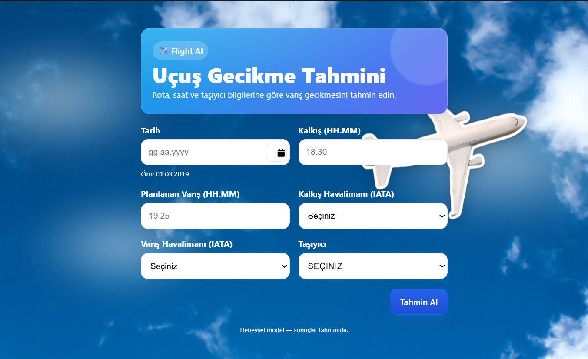
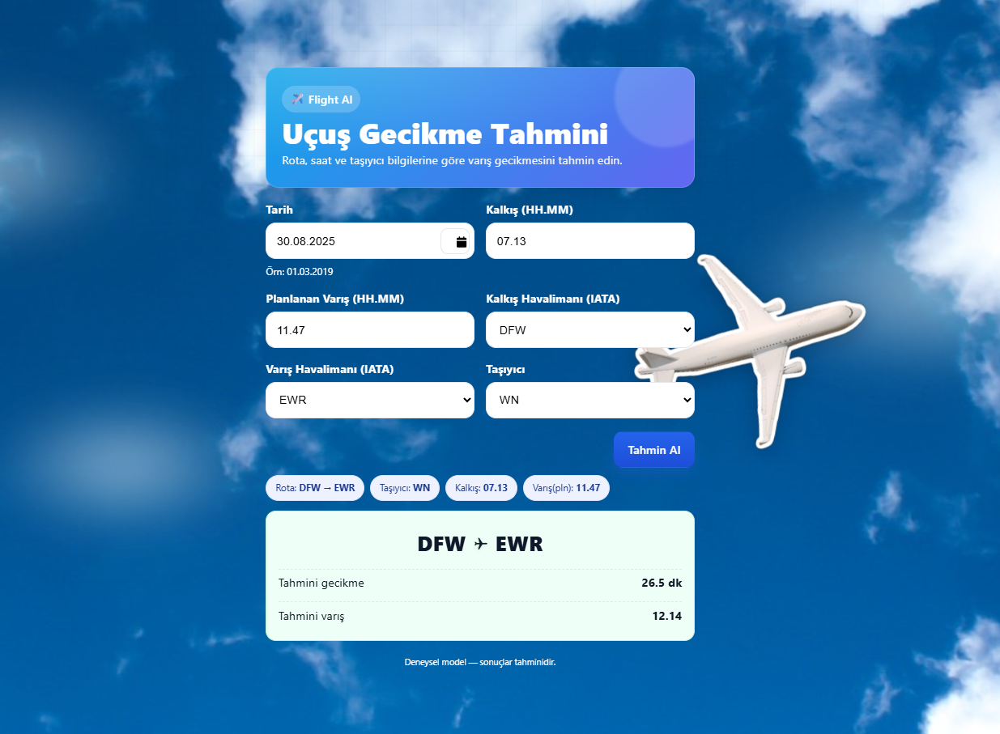

# Flight-AI ✈️ — Uçuş Gecikme Tahmini

Uçuş tarihi, kalkış/varış saatleri, havalimanları (IATA) ve taşıyıcı bilgilerine göre **uçuş gecikmesi (dk)** ve **tahmini varış saatini** tahmin eden bir makine öğrenmesi uygulaması.  
Backend: **FastAPI** · Model: **XGBoost** · Frontend: **React (Vite)**

---

## İçerik
- [Özellikler](#özellikler)
- [Mimari](#mimari)
- [Ekran Görüntüleri](#ekran-görüntüleri)
- [Kurulum](#kurulum)
  - [Backend (FastAPI)](#backend-fastapi)
  - [Frontend (React)](#frontend-react)
- [API](#api)
- [Model](#model)
- [Dizin Yapısı](#dizin-yapısı)
- [Geliştirme Notları](#geliştirme-notları)
- [Lisans](#lisans)

---

## Özellikler
- ✨ **Makine öğrenmesi**: XGBoost ile eğitilmiş model  
- ⚡ **FastAPI**: REST API servisi (Uvicorn ile)  
- 🎨 **React (Vite)**: Modern, hızlı ve animasyonlu kullanıcı arayüzü  
- ✅ **Form doğrulama**:  
  - Aynı havalimanı seçilirse hata  
  - Kalkış ve varış saati aynı olamaz uyarısı  
- 🧾 **Özet kartı**: Rota, taşıyıcı, kalkış/varış saati ve tahmini gecikme  
- ☁️ **Arka plan & uçak animasyonu**: Daha sezgisel bir deneyim

---

## Mimari
- **Backend (FastAPI)** → Kullanıcıdan gelen girdileri alır, doğrular ve modeli çağırır.  
- **Model (XGBoost)** → Eğitimli gecikme tahmin modeli. Dakika cinsinden gecikmeyi ve tahmini varış saatini döndürür.  
- **Frontend (React)** → Kullanıcı giriş formu, validasyon, özet bilgileri ve sonuç kartını gösterir. Axios ile API’ye bağlanır.  

---

## Ekran Görüntüleri

<p align="center">
  
</p>

<p align="center">
  
</p>

---

## Kurulum

### Backend (FastAPI)
```bash
cd backend
python -m venv .venv
.venv\Scripts\activate    # Windows
pip install -r requirements.txt
uvicorn main:app --reload
